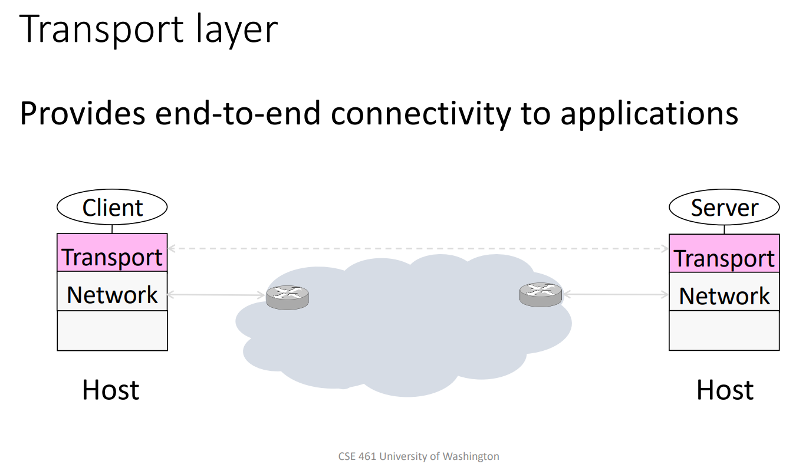

# IPK24CHAT client

This is a client application for the IPK24CHAT protocol. It came into being
as my solution to the first assignment of the IPK course.

Author: Vit Pavlik (`xpavli0a`)

Date: March 31, 2024

## Build instructions

This program is written in the C programming language and is specific for
linux-based systems, because it utilizes the `epoll` I/O notification
facility.

 ### Prerequisites:

- GNU Make (version `4.4.1` works)
- GCC compiler (version `12.3.0` works)
- ISO C11 Concurrency support library on the system (i.e. `threads.h`, glibc
`2.38` works)
- support for `epoll` (linux `6.5.0-17-generic` with glibc `2.38` works)

### Build process:

- running `make` builds `ipk24chat-client` binary

## Usage

The client can be executed with following parameters:

`ipk24chat-client -t tcp|udp -s ADDRESS [-p PORT] [-d TIMEOUT]
[-r RETRIES] [-h]`

- `-t` - the desired transport protocol: this program can do bot TCP and UDP
- `-s` - the address of an IPK24CHAT server
  - this can be a number (e. g. `2481260788`), a dotted-decimal address (e. g.
`147.229.8.244`) or a domain name (e. g. `anton5.fit.vutbr.cz`)
- `-p` - port to use (the default is `4567`)
  - values between `0` and `65535`
- `-d` - number of miliseconds the client will wait before retransmitting
messages if they were not confirmed as delivered by server (only for UDP)
  - value needs to fit into `unsigned int` C data type
  - on a linux machine with gcc compiler, this will most likely mean
a value range between `0` and `4294967296`
- `-r` - how many times will the client transmit the messages if they are
not confirmed as delivered by server (only for UDP)
  - after 1 transmission and n - 1 retransmissions (where n is the value given
to `-r` option), the client consider further effort to send the message
hopeless and print an error that the message couldn't be sent
  - value range is the same as for `-d`
- `-h` - print usage information and exit


*Note that arguments are parsed using the POSIX `getopt` library, therefore,
if an option is specified more than once, the last one is used.*
- *Example: `ipk24chat-client -t udp -s localhost -r 20 -r 5` will mean
the program takes `-r 5`.* \[1\]

## Theoretical background

This project solves a network communication of many users. The users (clients)
communicate through a server: IPK24CHAT is a client-server architecture.

The goals of this client application are following:
- establish 1 to 1 connection with the server
- provide user interface for the user
- output data sent by server for the user
- send user's data to the server

The user interface is set up via standard streams
\[2\] - standard output, standard
input and standard error stream.

### Standard output and standard error

There's little to worry about regarding the
output - the output is line buffered, so each time a message is outputted,
the user sees it right away, assuming he has the standard output connected
to an interactive device (ie. a terminal). \[3\]

I'm assuming that if the user redirects the output to a file, he won't be
examining it's contents right away, even though that's not impossible:
someone could `tail -f` the file, for example.

### Standard input

Standard input poses a significant problem for the application, because,
assuming it's not a file, it contents are not available right away and can
come at any time. Whether standard input stream is connected to a terminal or
it's another stream (a pipe), the application needs to be notified about
when data on the standard input stream becomes ready. Otherwise, it would
block on the `read` operation and couldn't process data from the server in the
meantime.

It's worth noting that we should also allow the standard input to be a file.
This way, someone can for example build another application on top of
IPK24CHAT, like file transfer.

### Network

On an application layer, we don't know nor care about how data gets to the
other side, like what route it takes or what hardware network interface we use.
All this is provided to us by the transport layer of the TCP/IP stack. \[4\]



For operating the transport layer, that is for sending application data
(application layer), we utilize the socket API that the operating system
provides for us. A socket is an abstraction from the rest of the network - we
can imagine it like a door to the other side. Behind that door is the server
application. \[5\]
Only thing left for us to do is make sure the data gets there sometime somehow.

In case of TCP, this is as simple as checking the return value of `send`. In
TCP, `send` is most often successful, unless the connection was reset or
something. In that case, the connection needs to be re-established so only
thing to do end the application, so the user can run it again if he wants.

In UDP, we have no way of knowing if the data made its way to the destination
host (server), so the server needs to actively reply another application data
that confirm the server got our data. This is addressed in the IPK24CHAT
protocol. In case we don't receive a confirmation to our data in a given amount
of time, we send them again. We try to do that only a given number of times
until we receive the confirmation, and if we don't, we consider the connection
finished. This poses a problem that we need to somehow *wait* for the
confirmation data. \[6\]

Receiving data from the server poses the same problem as standard input, they
can come at any unspecified point in time. Trying to read data from the network
before they come would again result in blocking.

## Activity diagram, interesting source code sections

Implementation for the TCP and UDP variant is quite different, because
they solve different problems and UDP variant spawns a listener thread,
while TCP variant is single-threaded.

### Activity diagram for the TCP variant


You can see the concept behind when the TCP variant of the program blocks on
network and when it blocks on both network and standard input (stdin).

### Differences of the UDP variant

While the UDP variant is implemented differently, it follows the same
principles as the TCP variant.

There are two threads,
a listener thread and a sender (main) thread.

The distributin of work between the threads make it simpler for the sender
thread to wait for confirmation of its messages, because the sender thread
isn't bothered by messages different than CONFIRM or REPLY.

The listener and sender thread communicate through an `udp_conmfirmer`
interface (see `udp_confirmer.h` and `udp_confirmer.c`) and also some
flags/variables given to the listener as arguments. Accessing the shared
variables and the confirmer module is controlled via a global lock named
`gcl` - global client lock.

The downfall of this is that the UDP variant has a lot of boilerplate
code which is necessary to control the spawning and controlling the listener
thread. Therefore, the UDP client code is a bit more complicated and messy
than the TCP client code. Compare `udpcl.c` and `tcpcl.c`.

Also, the sender thread blocks on standard input, but this turned out to be
impractical, because while the sender thread (which is also the main thread)
is waiting for input, the listener could receive a BYE message and the sender
wouldn't know about it.

I solved this by making the sender thread wait for input only a limited amount
of time and check periodically if listener hasn't finished yet.

```c
/* while blocking for stdin, ocassionally check if listener hasnt
finished yet (if stdin is a file, this is never performed) */
bool should_wait = true;
while (epoll_fd != -1 and should_wait) {
    int epr = epoll_wait(epoll_fd, events, 1, UDP_STDIN_TIMEOUT_MS);
    if (epr == 1) {  // stdin event
        should_wait = false;  // done flag for the inner while loop
    }
    mtx_lock(&listener_mtx);
    if (listener_done_flag) {
        should_send_bye = not listener_server_sent_bye;
        goto after_outer_loop;  // double break
    }
    mtx_unlock(&listener_mtx);
}
```

This is a constant `UDP_STDIN_TIMEOUT_MS` in `udpcl.c`, I chose 50 ms.

**Note:** the UDP Confirmer turned out to be needlessly complicated because
it can handle more unconfirmed messages at a time, but the sender thread never
sends more than one message at a time. This is because upon sending,
the sender thread waits until its message is marked as confirmed.

## Testing

There are a couple of unit tests: `test_argparse.c` and `test_tcp_parse.c`.

Both are compiled & run by running `make test`.

Furthermore, there are a couple of batch text files as input for the program,
`test_various.txt` and `test_lines.txt`

### test_argparse

To quote the header in `test_argparse.c`:
*this file utilizes the argparse module and returns 0 or 1 depending on
whether the arguments are correct - this code itself does not test argparse*.
This is why there is also `test.sh` - which tests if all the different
permutations of correct program options return 0.

The output is following
```log
./test.sh
OK: '-s localhost -t udp'
OK: '-s vitapavlik.cz -t tcp'
OK: '-s vitapavlik.cz -t tcp -p'
OK: '-t udp -s 127.0.0.1 -p 123 -d 50 -r 5'
OK: '-t udp -s 127.0.0.1 -p 123 -r 5 -d 50'
OK: '-t udp -s 127.0.0.1 -d 50 -p 123 -r 5'
OK: '-t udp -s 127.0.0.1 -d 50 -r 5 -p 123'
OK: '-t udp -s 127.0.0.1 -r 5 -p 123 -d 50'
OK: '-t udp -s 127.0.0.1 -r 5 -d 50 -p 123'
OK: '-t udp -p 123 -s 127.0.0.1 -d 50 -r 5'
OK: '-t udp -p 123 -s 127.0.0.1 -r 5 -d 50'
OK: '-t udp -p 123 -d 50 -s 127.0.0.1 -r 5'
OK: '-t udp -p 123 -d 50 -r 5 -s 127.0.0.1'
OK: '-t udp -p 123 -r 5 -s 127.0.0.1 -d 50'
OK: '-t udp -p 123 -r 5 -d 50 -s 127.0.0.1'
OK: '-t udp -d 50 -s 127.0.0.1 -p 123 -r 5'
OK: '-t udp -d 50 -s 127.0.0.1 -r 5 -p 123'
OK: '-t udp -d 50 -p 123 -s 127.0.0.1 -r 5'
OK: '-t udp -d 50 -p 123 -r 5 -s 127.0.0.1'
OK: '-t udp -d 50 -r 5 -s 127.0.0.1 -p 123'
OK: '-t udp -d 50 -r 5 -p 123 -s 127.0.0.1'
OK: '-t udp -r 5 -s 127.0.0.1 -p 123 -d 50'
OK: '-t udp -r 5 -s 127.0.0.1 -d 50 -p 123'
OK: '-t udp -r 5 -p 123 -s 127.0.0.1 -d 50'
OK: '-t udp -r 5 -p 123 -d 50 -s 127.0.0.1'
OK: '-t udp -r 5 -d 50 -s 127.0.0.1 -p 123'
OK: '-t udp -r 5 -d 50 -p 123 -s 127.0.0.1'
OK: '-s 127.0.0.1 -t udp -p 123 -d 50 -r 5'
OK: '-s 127.0.0.1 -t udp -p 123 -r 5 -d 50'
OK: '-s 127.0.0.1 -t udp -d 50 -p 123 -r 5'
OK: '-s 127.0.0.1 -t udp -d 50 -r 5 -p 123'
OK: '-s 127.0.0.1 -t udp -r 5 -p 123 -d 50'
OK: '-s 127.0.0.1 -t udp -r 5 -d 50 -p 123'
OK: '-s 127.0.0.1 -p 123 -t udp -d 50 -r 5'
OK: '-s 127.0.0.1 -p 123 -t udp -r 5 -d 50'
OK: '-s 127.0.0.1 -p 123 -d 50 -t udp -r 5'
OK: '-s 127.0.0.1 -p 123 -d 50 -r 5 -t udp'
OK: '-s 127.0.0.1 -p 123 -r 5 -t udp -d 50'
OK: '-s 127.0.0.1 -p 123 -r 5 -d 50 -t udp'
OK: '-s 127.0.0.1 -d 50 -t udp -p 123 -r 5'
OK: '-s 127.0.0.1 -d 50 -t udp -r 5 -p 123'
OK: '-s 127.0.0.1 -d 50 -p 123 -t udp -r 5'
OK: '-s 127.0.0.1 -d 50 -p 123 -r 5 -t udp'
OK: '-s 127.0.0.1 -d 50 -r 5 -t udp -p 123'
OK: '-s 127.0.0.1 -d 50 -r 5 -p 123 -t udp'
OK: '-s 127.0.0.1 -r 5 -t udp -p 123 -d 50'
OK: '-s 127.0.0.1 -r 5 -t udp -d 50 -p 123'
OK: '-s 127.0.0.1 -r 5 -p 123 -t udp -d 50'
OK: '-s 127.0.0.1 -r 5 -p 123 -d 50 -t udp'
OK: '-s 127.0.0.1 -r 5 -d 50 -t udp -p 123'
OK: '-s 127.0.0.1 -r 5 -d 50 -p 123 -t udp'
OK: '-p 123 -t udp -s 127.0.0.1 -d 50 -r 5'
OK: '-p 123 -t udp -s 127.0.0.1 -r 5 -d 50'
OK: '-p 123 -t udp -d 50 -s 127.0.0.1 -r 5'
OK: '-p 123 -t udp -d 50 -r 5 -s 127.0.0.1'
OK: '-p 123 -t udp -r 5 -s 127.0.0.1 -d 50'
OK: '-p 123 -t udp -r 5 -d 50 -s 127.0.0.1'
OK: '-p 123 -s 127.0.0.1 -t udp -d 50 -r 5'
OK: '-p 123 -s 127.0.0.1 -t udp -r 5 -d 50'
OK: '-p 123 -s 127.0.0.1 -d 50 -t udp -r 5'
OK: '-p 123 -s 127.0.0.1 -d 50 -r 5 -t udp'
OK: '-p 123 -s 127.0.0.1 -r 5 -t udp -d 50'
OK: '-p 123 -s 127.0.0.1 -r 5 -d 50 -t udp'
OK: '-p 123 -d 50 -t udp -s 127.0.0.1 -r 5'
OK: '-p 123 -d 50 -t udp -r 5 -s 127.0.0.1'
OK: '-p 123 -d 50 -s 127.0.0.1 -t udp -r 5'
OK: '-p 123 -d 50 -s 127.0.0.1 -r 5 -t udp'
OK: '-p 123 -d 50 -r 5 -t udp -s 127.0.0.1'
OK: '-p 123 -d 50 -r 5 -s 127.0.0.1 -t udp'
OK: '-p 123 -r 5 -t udp -s 127.0.0.1 -d 50'
OK: '-p 123 -r 5 -t udp -d 50 -s 127.0.0.1'
OK: '-p 123 -r 5 -s 127.0.0.1 -t udp -d 50'
OK: '-p 123 -r 5 -s 127.0.0.1 -d 50 -t udp'
OK: '-p 123 -r 5 -d 50 -t udp -s 127.0.0.1'
OK: '-p 123 -r 5 -d 50 -s 127.0.0.1 -t udp'
OK: '-d 50 -t udp -s 127.0.0.1 -p 123 -r 5'
OK: '-d 50 -t udp -s 127.0.0.1 -r 5 -p 123'
OK: '-d 50 -t udp -p 123 -s 127.0.0.1 -r 5'
OK: '-d 50 -t udp -p 123 -r 5 -s 127.0.0.1'
OK: '-d 50 -t udp -r 5 -s 127.0.0.1 -p 123'
OK: '-d 50 -t udp -r 5 -p 123 -s 127.0.0.1'
OK: '-d 50 -s 127.0.0.1 -t udp -p 123 -r 5'
OK: '-d 50 -s 127.0.0.1 -t udp -r 5 -p 123'
OK: '-d 50 -s 127.0.0.1 -p 123 -t udp -r 5'
OK: '-d 50 -s 127.0.0.1 -p 123 -r 5 -t udp'
OK: '-d 50 -s 127.0.0.1 -r 5 -t udp -p 123'
OK: '-d 50 -s 127.0.0.1 -r 5 -p 123 -t udp'
OK: '-d 50 -p 123 -t udp -s 127.0.0.1 -r 5'
OK: '-d 50 -p 123 -t udp -r 5 -s 127.0.0.1'
OK: '-d 50 -p 123 -s 127.0.0.1 -t udp -r 5'
OK: '-d 50 -p 123 -s 127.0.0.1 -r 5 -t udp'
OK: '-d 50 -p 123 -r 5 -t udp -s 127.0.0.1'
OK: '-d 50 -p 123 -r 5 -s 127.0.0.1 -t udp'
OK: '-d 50 -r 5 -t udp -s 127.0.0.1 -p 123'
OK: '-d 50 -r 5 -t udp -p 123 -s 127.0.0.1'
OK: '-d 50 -r 5 -s 127.0.0.1 -t udp -p 123'
OK: '-d 50 -r 5 -s 127.0.0.1 -p 123 -t udp'
OK: '-d 50 -r 5 -p 123 -t udp -s 127.0.0.1'
OK: '-d 50 -r 5 -p 123 -s 127.0.0.1 -t udp'
OK: '-r 5 -t udp -s 127.0.0.1 -p 123 -d 50'
OK: '-r 5 -t udp -s 127.0.0.1 -d 50 -p 123'
OK: '-r 5 -t udp -p 123 -s 127.0.0.1 -d 50'
OK: '-r 5 -t udp -p 123 -d 50 -s 127.0.0.1'
OK: '-r 5 -t udp -d 50 -s 127.0.0.1 -p 123'
OK: '-r 5 -t udp -d 50 -p 123 -s 127.0.0.1'
OK: '-r 5 -s 127.0.0.1 -t udp -p 123 -d 50'
OK: '-r 5 -s 127.0.0.1 -t udp -d 50 -p 123'
OK: '-r 5 -s 127.0.0.1 -p 123 -t udp -d 50'
OK: '-r 5 -s 127.0.0.1 -p 123 -d 50 -t udp'
OK: '-r 5 -s 127.0.0.1 -d 50 -t udp -p 123'
OK: '-r 5 -s 127.0.0.1 -d 50 -p 123 -t udp'
OK: '-r 5 -p 123 -t udp -s 127.0.0.1 -d 50'
OK: '-r 5 -p 123 -t udp -d 50 -s 127.0.0.1'
OK: '-r 5 -p 123 -s 127.0.0.1 -t udp -d 50'
OK: '-r 5 -p 123 -s 127.0.0.1 -d 50 -t udp'
OK: '-r 5 -p 123 -d 50 -t udp -s 127.0.0.1'
OK: '-r 5 -p 123 -d 50 -s 127.0.0.1 -t udp'
OK: '-r 5 -d 50 -t udp -s 127.0.0.1 -p 123'
OK: '-r 5 -d 50 -t udp -p 123 -s 127.0.0.1'
OK: '-r 5 -d 50 -s 127.0.0.1 -t udp -p 123'
OK: '-r 5 -d 50 -s 127.0.0.1 -p 123 -t udp'
OK: '-r 5 -d 50 -p 123 -t udp -s 127.0.0.1'
OK: '-r 5 -d 50 -p 123 -s 127.0.0.1 -t udp'
```

### test_tcp_parse

To test parsing of the TCP messages defined by IPK24CHAT ABNF grammar, I made
this small unit test:

```c
test("mSg frOm server iS hello, this is a message\r\n",  PR_MSG);
test("eRr froM server iS hello, this is an error\r\n",   PR_ERR);
test("rePly nOk iS yo this is a unsuccessful reply\r\n", PR_REPLY_NOK);
test("rEply oK iS yo this is a successful reply\r\n",    PR_REPLY_OK);
test("bYe\r\n",                                          PR_BYE);
```

where `PR_MSG`, `PR_ERR`, `PR_REPLY_NOK`, `PR_REPLY_OK` and `PR_BYE` are
the expected values of a predefined enum type, which the parse function
returns.

### test_various

The `test_various.txt` file contains a few valid lines and few invalid lines.
We expect only the valid lines to be sent to a server.

`test_various.txt`:
```
/auth a b c
eyo
/auth x y z
wassup
/rename kvitek
yo
/rename aaaaaaaaaaaaaaaaaaaaaaaaaaaaaaaaaaaaaaaaaaaaaaaaaaaaaaaaaaaaaaaaaaaaaaa
kkkkkk
/join abc
jfiernhgtbir
/join aaaaaaaaaaaaaaaaaaaaaaaaaaaaaaaaaaaaaaaaaaaaaaaaaaaaaaaaaaaaaaaaaaaaaaa
kdaofisgodnb
pepik
ěščřžýáíé
abcd
/auth
/join
/rename
/help
/helpp
/authh
/joinn
/renamee
```

client output on the terminal (ie. both stdout and stderr):
```
./ipk24chat-client -t tcp -s localhost < test_various.txt
Success: ok
ERR: already authenticated
ERR: invalid /rename command
Success: ok
ERR: invalid /join command
ERR: non-printable characters
ERR: already authenticated
ERR: invalid /join command
ERR: invalid /rename command
Available commands:
  /auth username secret displayname -- authenticate if not authenticated yet
  /join channel_id -- join a new channel
  /rename displayname -- change the display name for future messages
Parameter length restrictions:
  username:    20 characters
  secret:      128 characters
  displayname: 20 characters
  channel_id:  20 characters
Other inputs that don't represent any known command will be
interpreted as a message and a message can be no longer than 1400 characters
```

output of `netcat -l -C 4567`:
```
aUtH a aS c uSinG b
reply ok is ok
msG FRoM c iS eyo
msG FRoM c iS wassup
msG FRoM kvitek iS yo
msG FRoM kvitek iS kkkkkk
jOIn abc aS kvitek
reply ok is ok
msG FRoM kvitek iS jfiernhgtbir
msG FRoM kvitek iS kdaofisgodnb
msG FRoM kvitek iS pepik
msG FRoM kvitek iS abcd
msG FRoM kvitek iS /helpp
msG FRoM kvitek iS /authh
msG FRoM kvitek iS /joinn
msG FRoM kvitek iS /renamee
bYe
```

You can see no invalid messages were sent.

**Note:** I had to type `reply ok is ok` into netcat after the AUTH message
and after the JOIN message for the test to finish. Also, I am using
`OpenBSD netcat (Debian patchlevel 1.219-1)`.

### test_lines

To test the program for memory leaks, I crafted `test_lines.txt`, which
contains one line with the `/auth` command and then 4096 lines to be
interpreted as messages. I then run the program using
`valgrind -s --track-origins=yes --leak-check=full --show-leak-kinds=all --track-fds=yes ./ipk24chat-client -t tcp -s localhost`
with `netcat -l -C 4567` running in another terminal window.

valgrind output:
```
valgrind -s --track-origins=yes --leak-check=full --show-leak-kinds=all --track-fds=yes ./ipk24chat-client -t tcp -s localhost < test_lines.txt
==23082== Memcheck, a memory error detector
==23082== Copyright (C) 2002-2022, and GNU GPL'd, by Julian Seward et al.
==23082== Using Valgrind-3.23.0.GIT and LibVEX; rerun with -h for copyright info
==23082== Command: ./ipk24chat-client -t tcp -s localhost
==23082==
Success: ok
==23082==
==23082== FILE DESCRIPTORS: 3 open (3 std) at exit.
==23082==
==23082== HEAP SUMMARY:
==23082==     in use at exit: 0 bytes in 0 blocks
==23082==   total heap usage: 98,736 allocs, 98,736 frees, 154,401,837 bytes allocated
==23082==
==23082== All heap blocks were freed -- no leaks are possible
==23082==
==23082== ERROR SUMMARY: 0 errors from 0 contexts (suppressed: 0 from 0)
```

**Note:** I again typed `reply ok is ok` into netcat and, like expected,
last line of the netcat output was `bYe`. Also, there are 3 file descriptors
open at exit, which is expected. These are standart input, error and output.
These are usually not closed, depending on the C runtime configuration.

## Bibliography

\[1\]
Looijaard Frodo.
*getopt - parse command options*
\[Computer program\]
December, 2023 \[cited 2024-03-31\]
Available at:
https://man7.org/linux/man-pages/man3/getopt.3.html

\[2\]
Ritchie, Dennis M.
*A Stream Input-Output System*
\[online\]
October, 1984 \[cited 2024-03-30\]
Available at:
https://www.bell-labs.com/usr/dmr/www/st.html

\[3\]
Glibc maintainters.
*Buffering Concepts*
\[online\]
\[cited 2024-03-30\]
Available at:
https://www.gnu.org/software/libc/manual/html_node/Buffering-Concepts.html

\[4\]
Department of Computer Science and Engineering, Univerity of Washington.
*Transport Layer (TCP/UDP)*
\[online\]
\[cited 2024-03-31\]
Available at:
https://courses.cs.washington.edu/courses/cse461/20sp/slides/3-transport-apr3.pdf


\[5\]
Amarasinghe Saman; Chlipala Adam; Devadas Srini; Ernst Michael; Goldman Max; Guttag John; Jackson Daniel; Miller Rob; Rinard Martin and Solar-Lezama, Armando.
*Sockets & Networking*
\[online\]
Fall 2019 \[cited 2024-03-31\]
Available at:
https://web.mit.edu/6.031/www/fa19/classes/23-sockets-networking/

\[6\]
IBM Corp.
*C socket UDP client*
\[online\]
April, 2023 \[cited 2024-03-31\]
Available at:
https://www.ibm.com/docs/en/zos/3.1.0?topic=programs-c-socket-udp-client


